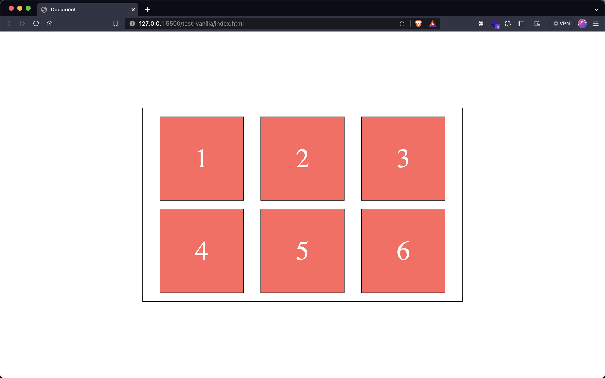

# drag-drop-tool

### Draggable Elements Demo

To demonstrate the usage of the `drag-container` and `drag-box` elements, follow these steps:

1. Create an HTML file (e.g., `index.html`) and a CSS file (e.g., `styles.css`) in your project.

2. initialise your project for npm with

```
npm init
```

3. install drag-drop-tool with:

```
npm i drag-drop-tool
```

4. Add the following script tag at the end of the body in your html file:

**index.html**:

```html
<script src="./node_modules/drag-drop-tool/src/index.js"></script>
```

**Alternatively**

You can skip installing with NPM and include it directly from a CDN such as unpkg like so, e,g:

**index.html**:

```html
<script src="https://unpkg.com/drag-drop-tool@*LATEST VERSION*/src/index.js"></script>
```

replacing _LATEST VERSION_ with the latest release

5. Congrats, you now have access to the drag-container and drag-box custom elements so you can utilise them by adding a `<drag-container>` element and populating it with some `<drag-box>` elements like so:

**index.html**:

```html
<!DOCTYPE html>
<html lang="en">
  <head>
    <meta charset="UTF-8" />
    <meta name="viewport" content="width=device-width, initial-scale=1.0" />
    <title>Draggable Elements Demo</title>
    <link rel="stylesheet" href="styles.css" />
  </head>
  <body>
    <drag-container>
      <drag-box>1</drag-box>
      <drag-box>2</drag-box>
      <drag-box>3</drag-box>
      <drag-box>4</drag-box>
      <drag-box>5</drag-box>
      <drag-box>6</drag-box>
    </drag-container>

    <script src="./node_modules/drag-drop-tool/src/index.js"></script>
  </body>
</html>
```

6. Add some basic styling:

**styles.css**

```css
body {
  display: grid;
  place-items: center;
  width: 100vw;
  height: 100vh;
  margin: 0;
  padding: 0;
  box-sizing: border-box;
}

drag-container {
  width: 50vw;
  display: flex; /* this is already set by default */
  flex-flow: row wrap;
  border: 1px solid;
  justify-content: space-evenly;
  gap: 20px;
  padding: 20px;
}

drag-box {
  width: 200px;
  height: 200px;
  border: 1px solid black;
  background-color: rgb(255 0 0 /70%);
  display: grid;
  place-items: center;
  color: white;
  font-size: 4rem;
}
```

And that's it, your page should now look a little something like this:



And you are now able to re-order these boxes by dragging and placing in the desired position in the list

MORE INFO COMING SOON
